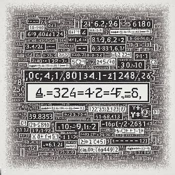
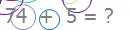
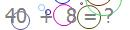
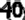
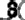
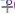
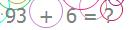
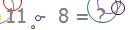
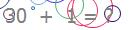
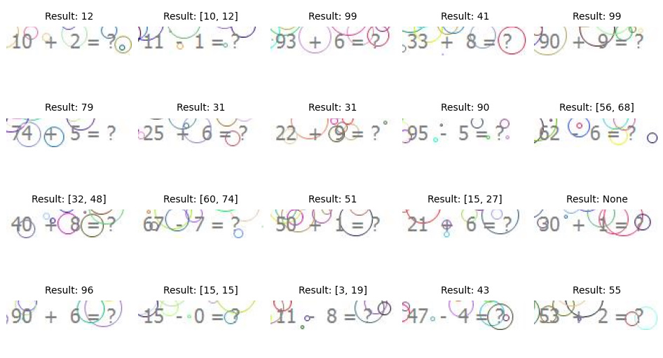

<div align="center">
  <a href="https://github.com/AmireNoori/MathCaptchaSolver">
    
  </a>

  <h3 align="center">َAmir Noori - Math Captcha Solver</h3>

  <p align="center">
    A great tool for solving math captchas !
  </p>
</div>


<!-- TABLE OF CONTENTS -->
<details>
  <summary>Table of Contents</summary>
  <ol>
    <li>
      <a href="#about-the-project">About The Project</a>
      <ul>
        <li><a href="#built-with">Built With</a></li>
      </ul>
    </li>
    <li>
      <a href="#How-it-processes">How it processes</a>
      <ul>
        <li><a href="#installation">Installation</a></li>
      </ul>
    </li>
    <li><a href="#usage">Usage</a></li>
    <li><a href="#license">License</a></li>
    <li><a href="#contact">Contact</a></li>
    <li><a href="#kindness">Kindness</a></li>

  </ol>
</details>


<!-- ABOUT THE PROJECT -->
## About The Project

This project is a tool to process mathematical captcha images and calculate the answer using deep learning models and image processing using Python language.

An example of captchas used in this project:




<p align="right">(<a href="#readme-top">back to top</a>)</p>


### Built With

The deep learning model used in this tool: It is `TrOCR (large-sized model, fine-tuned on SROIE)`, which you can download from the link [https://huggingface.co/microsoft/trocr-large-printed](https://huggingface.co/microsoft/trocr-large-printed) and read about it.
The TrOCR model is an encoder-decoder model, consisting of an image Transformer as encoder, and a text Transformer as decoder.
Python language and opecv library
* ![Hugging face][huggingface.co](https://huggingface.co/datasets/huggingface/brand-assets/resolve/main/hf-logo-with-title.png)
* ![Open CV][opencv.org](https://opencv1.b-cdn.net/wp-content/uploads/2020/07/OpenCV_logo_black-2.png)
* ![Python][www.python.org](https://www.python.org/static/community_logos/python-logo.png)


<p align="right">(<a href="#readme-top">back to top</a>)</p>


## How it processes

The processing of numbers and signs in the image is performed by the powerful model that I introduced above. But to process this type of captcha images, this model alone was not able to correctly extract the numbers and calculate the operation. So we had to use image processing to improve the result.

* First, let's see what will be returned if we give the complete captcha image to the model:



* Output
  ```sh
  [{'generated_text': '40 % & @'}]
  ```

As you can see, the output returned to us is `40 % & @`, which is not a very good result.

So we first used morphological operations to erode the image and erase the extra lines to some extent, then we gave the image a more normal state using the blur method.
And finally, we used the crop technique to save two numbers separately with the sign between them with fixed coordinates of each number in all captcha images.

Now we have three pictures, two numbers and a math symbol :

        


Next, according to the extracted numbers in the image, the function performs the subtraction or addition operation and returns the answer to us.

The output of the tool is in 3 different types.

* 1-The first type of output is an `integer` that is the sum or subtraction of two numbers.this output is displayed when the math sign is correctly recognized

Example:



* Output
  ```sh
  99
  ```

* 2-The second type of output is a `list` containing two numbers.

This output is displayed when the tool is able to recognize the numbers, but despite the possible filters that have been set for the sign, it is not able to recognize the sign and is forced to add or subtract the numbers together, and the list it displays is the total result.you can test both answers in the input according to the output of the tool

Example:



* Output
  ```sh
  [3, 19]
  ```

* 3-The third type of output is `None`.

This output is displayed when the tool is not able to recognize one of the two numbers and as a result could not calculate the numbers together.
This case happens very rarely and the tool detects the numbers correctly in most cases, but it may still show you such an output.



* Output
  ```sh
  None
  ```

* Execution Time
Captcha processing and calculation time in a system without GPU is between `16` seconds and `20` seconds from the time of execution to the end time, which is much less in systems with GPU and the processing speed is faster.


### Installation

1. Clone the repo
   ```sh
   git clone https://github.com/AmireNoori/MathCaptchaSolver
   ```

You must have installed `transformers`, `opencv-python` and `numpy` libraries. For this, you can install each of them separately or install this tool using the `requirements.txt` file by entering the following command in the terminal.

2. Install packages
   ```sh
   pip install -r requirements.txt
   ```

## Usage

This tool is written in the form of a library that you can easily import and use in your robot or program.

* An example of how to use :

_Create a `main.py` file and enter the following codes in it._

* Examples
  ```sh
  from MathCaptchaSolver import CaptchaSolver
  solver = CaptchaSolver('Your captcha Image path') # Enter captcha Image path
  result = solver.solve_captcha()
  print(result)
  ```
* Terminal
  ```sh
  python main.py
  ```

_Note: When you run the program for the first time, your system must be connected to the Internet to download the model from the Hugging Face website and it may take some time to run the program for the first time._
## Examples


This screenshot is an example of the results obtained from the 20 captcha images shared for you
<div align="center">
    
</div>


<p align="right">(<a href="#readme-top">back to top</a>)</p>


## License

This project is licensed under the [MIT License](LICENSE).

### MIT License

MIT License

Copyright (c) [2024] [Amir Noori]

Permission is hereby granted, free of charge, to any person obtaining a copy
of this software and associated documentation files (the "Software"), to deal
in the Software without restriction, including without limitation the rights
to use, copy, modify, merge, publish, distribute, sublicense, and/or sell
copies of the Software, and to permit persons to whom the Software is
furnished to do so, subject to the following conditions:

The above copyright notice and this permission notice shall be included in all
copies or substantial portions of the Software.

THE SOFTWARE IS PROVIDED "AS IS", WITHOUT WARRANTY OF ANY KIND, EXPRESS OR
IMPLIED, INCLUDING BUT NOT LIMITED TO THE WARRANTIES OF MERCHANTABILITY,
FITNESS FOR A PARTICULAR PURPOSE AND NONINFRINGEMENT. IN NO EVENT SHALL THE
AUTHORS OR COPYRIGHT HOLDERS BE LIABLE FOR ANY CLAIM, DAMAGES OR OTHER
LIABILITY, WHETHER IN AN ACTION OF CONTRACT, TORT OR OTHERWISE, ARISING FROM,
OUT OF OR IN CONNECTION WITH THE SOFTWARE OR THE USE OR OTHER DEALINGS IN THE
SOFTWARE.

© [Amir Noori](https://github.com/AmireNoori)


<p align="right">(<a href="#readme-top">back to top</a>)</p>


## Contact

Amir Noori - [@AmireNoori1](https://t.me/AmireNoori1) - noorifardam@gmail.com

Project Link: [https://github.com/AmireNoori/MathCapthaSolver](https://github.com/AmireNoori/MathCaptchaSolver)

<p align="right">(<a href="#readme-top">back to top</a>)</p>

## Kindness

Thank you if this tool was useful for you and you used it, give it a star ⭐ and make me happy by following my profile❤️.
