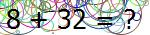

<details>
  <summary>Table of Contents</summary>
  <ol>
    <li>
      <a href="#about-the-project">About The Project</a>
    </li>
    <li>
      <ul>
        <li><a href="#installation">Installation</a></li>
      </ul>
    </li>
    <li><a href="#usage">Usage</a></li>
    <li><a href="#license">License</a></li>
    <li><a href="#contact">Contact</a></li>
  </ol>
</details>


## About The Project



This type of captcha is very similar to the captcha in [MathCaptchaSolver](https://github.com/AmireNoori/MathCaptchaSolver) main branch.
So if you want to know more about the details of the project, refer to this link:

[MathCaptchaSolver](https://github.com/AmireNoori/MathCaptchaSolver)

### Installation

1. Clone the repo
   ```sh
   git clone https://github.com/AmireNoori/MathCaptchaSolver-v2
   ```

You must have installed `transformers`, `opencv-python` and `numpy` libraries. For this, you can install each of them separately or install this tool using the `requirements.txt` file by entering the following command in the terminal.

2. Install packages
   ```sh
   pip install -r requirements.txt
   ```

## Usage

This tool is written in the form of a library that you can easily import and use in your robot or program.

* An example of how to use :

_Create a `main.py` file and enter the following codes in it._

* Example
  ```sh
  from MathCaptchaSolver import CaptchaSolver
  solver = CaptchaSolver('Your captcha Image path') # Enter captcha Image path
  result = solver.solve_captcha()
  print(result)
  ```
* Terminal
  ```sh
  python main.py
  ```

_Note: When you run the program for the first time, your system must be connected to the Internet to download the model from the Hugging Face website and it may take some time to run the program for the first time._
## Examples

This screenshot is an example of the results obtained from the 20 captcha images shared for you
<div align="center">
    
</div>

## License

This project is licensed under the [MIT License](LICENSE).

### MIT License

MIT License

Copyright (c) [2024] [Amir Noori]

Permission is hereby granted, free of charge, to any person obtaining a copy
of this software and associated documentation files (the "Software"), to deal
in the Software without restriction, including without limitation the rights
to use, copy, modify, merge, publish, distribute, sublicense, and/or sell
copies of the Software, and to permit persons to whom the Software is
furnished to do so, subject to the following conditions:

The above copyright notice and this permission notice shall be included in all
copies or substantial portions of the Software.

THE SOFTWARE IS PROVIDED "AS IS", WITHOUT WARRANTY OF ANY KIND, EXPRESS OR
IMPLIED, INCLUDING BUT NOT LIMITED TO THE WARRANTIES OF MERCHANTABILITY,
FITNESS FOR A PARTICULAR PURPOSE AND NONINFRINGEMENT. IN NO EVENT SHALL THE
AUTHORS OR COPYRIGHT HOLDERS BE LIABLE FOR ANY CLAIM, DAMAGES OR OTHER
LIABILITY, WHETHER IN AN ACTION OF CONTRACT, TORT OR OTHERWISE, ARISING FROM,
OUT OF OR IN CONNECTION WITH THE SOFTWARE OR THE USE OR OTHER DEALINGS IN THE
SOFTWARE.

© [Amir Noori](https://github.com/AmireNoori)

## Contact

Amir Noori - [@AmireNoori1](https://t.me/AmireNoori1) - noorifardam@gmail.com

Project Link: [https://github.com/AmireNoori/MathCapthaSolver](https://github.com/AmireNoori/MathCaptchaSolver)
